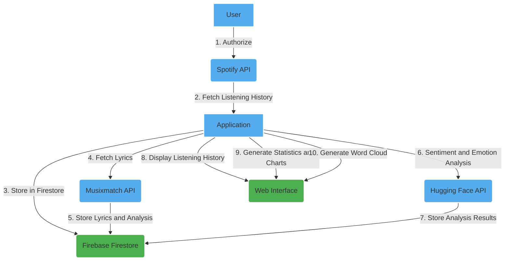

# Apnea Music

## Overview

The Apnea Music is a web application that interacts with the Spotify API, Musixmatch API, and Hugging Face API for sentiment and emotion analysis. It stores user's listening history and lyrics analysis results in Firebase Firestore.

## Features

- **Lyrics and Analysis Storage:** Fetches lyrics and performs sentiment and emotion analysis for each track in the user's listening history. Stores the results in Firebase Firestore.

- **Listening History:** Stores track details such as name, artist, album, timestamp, and sentiment/emotion analysis results.

- **Statistics and Charts:** Generates statistics and charts based on the user's listening history, including general statistics, sentiment, emotions, and track count over time.

- **Word Cloud Generator:** Creates a word cloud from the lyrics of all tracks.

## Functional Diagram

## Setup

1. Set up Firebase:

   - Create a Firebase project: [Firebase Console](https://console.firebase.google.com/).
   - Set up Firebase Authentication and Firestore. Add your Firebase config to `firebase-init.js`.
   
2. Set up APIs:

   - Get API keys for Musixmatch and Hugging Face. Add them to the `config` collection in Firestore.

## Usage

1. Open the application in a web browser.
2. Authorize with Spotify.
3. View listening history, statistics, and charts.

## Contributing

Contributions are welcome! Feel free to open issues or submit pull requests.

## License

This project is licensed under the [MIT License](LICENSE).
